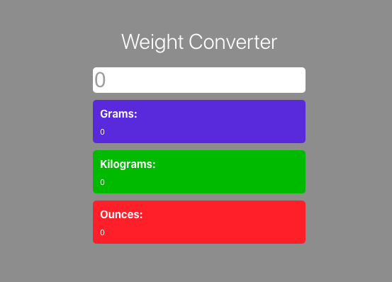

# Weight Converter App 

This mini App allows to convert the unit of weight - pounds to grams, kilograms and ounces.

### Link

- Live preview: [https://weight-converter-basiakedz.netlify.app/](https://weight-converter-basiakedz.netlify.app/)

## Getting Started with Create React App

This project was bootstrapped with [Create React App](https://github.com/facebook/create-react-app).

### Available Scripts

To setup project download or clone the repository.

In the project directory, you can run:

#### `npm install`

To start server:

#### `npm start`

Runs the app in the development mode.\
Open [http://localhost:3000](http://localhost:3000) to view it in your browser.

The page will reload when you make changes.\
You may also see any lint errors in the console.

#### `npm run build`

Builds the app for production to the `build` folder.\
It correctly bundles React in production mode and optimizes the build for the best performance.

The build is minified and the filenames include the hashes.\
Your app is ready to be deployed!

See the section about [deployment](https://facebook.github.io/create-react-app/docs/deployment) for more information.
